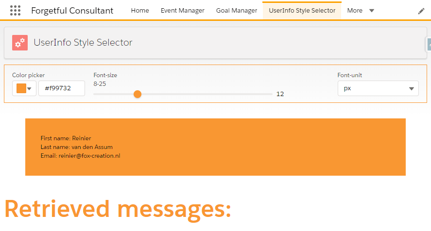
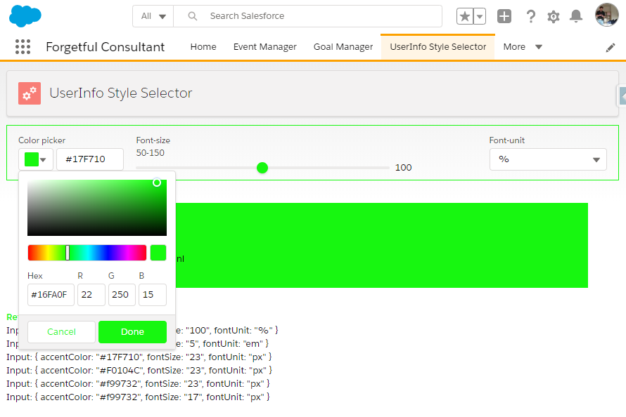
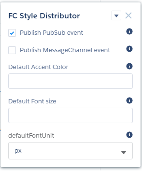

# LWC Style Distributor
Style Distributor Lightning Web Component for Salesforce.

On style change either/both a PubSub-event and/or Lightning-Message are published, for sibling components to listen to.

The component has been developed out of personal interest and learning and can be used without any cost,
as long as the original source is referenced.

Demo: <a href="http://lab.foxy-solutions.com/style-distributor" target="_blank"> http://lab.foxy-solutions.com/style-distributor </a>

## Included techniques

- CSS Variables (incl. Javascript get and set)
- Pub Sub (incl. minor library extensions)
- Lightning Messaging Service
- Lightning Web Components
- Aura Component

## How to apply

### Pre-requisites

- Salesforce Org with MyDomain enabled (required for Lightning Components)

### How to set-up
1) Retrieve this GIT Repository locally
2) Deploy the full folder structure to your own Salesforce Org
3) Grant your profile access to the StyleDistributor Tab (Default On)
4) Visit the StyleDistributor Tab

## Screenshots

Style Distributor within Salesforce Lightning Experience - initial page load

Style Distributor within Salesforce Lightning Experience - Example changes
[_Changed color and font-size slider range (due to font-unit change); list of retrieved messages_]

Style Distributor Input parameters

